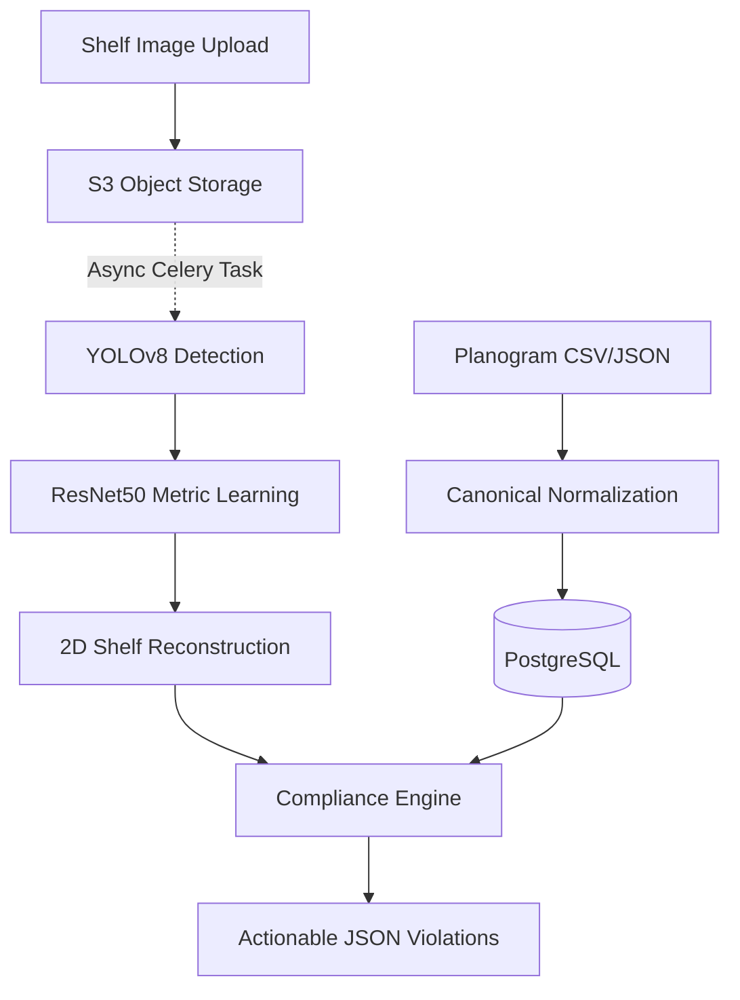

# Planogram Compliance System

An enterprise-grade, end-to-end computer vision pipeline for automated retail shelf monitoring, planogram compliance, and SKU recognition. 

This platform uses advanced machine learning (YOLOv8 + Siamese ResNet50 Metric Learning) to extract bounding boxes and identify products on retail shelves. It reconstructs the 2D physical shelf layout and deterministically compares it against ideal planograms to output strict compliance metrics and actionable violations.

---

## 🚀 System Architecture

---

## 🏗️ Technical Stack

- **Machine Learning**: PyTorch, Ultralytics (YOLOv8), Torchvision, OpenCV, Scikit-learn (DBSCAN).
- **Backend Services**: FastAPI, Python 3.14.
- **Database**: PostgreSQL (SQLAlchemy 2.x, Alembic, Multi-tenant Architecture).
- **Async Workers**: Celery + Redis (Message Broker & Result Backend).
- **Object Storage**: Amazon S3 (Boto3) for high-resolution retail images.
- **Security**: Argon2id Password Hashing, HTTP-only Session Cookies, JWTs, RBAC (Admin, Manager, Employee).

---

## 📈 ML Pipeline Performance

1. **Object Detection (YOLOv8 Nano)**
   - **mAP50**: 94.3%
   - **Precision**: 91.5% | **Recall**: 89.2%
   - *Highly capable of finding densely packed products on retail shelves despite heavy occlusion.*
2. **SKU Recognition (Target-Domain Metric Learning)**
   - **Top-1 / Top-5 Accuracy**: 100.0% (In-domain target dataset)
   - *Uses Triplet Margin Loss to perfectly separate target SKUs in a 2048-dimensional embedding space, without retraining standard classifiers when new SKUs are added.*
3. **Logical Reconstruction Engine**
   - Automatically clusters `center_y` coordinates using DBSCAN to detect shelf rows (without hardcoding shelf counts).
   - Outputs a standard JSON format ready for 1-to-1 deterministic comparison.

---

## 🗄️ Database & Storage Strategy

The backend transforms this ML pipeline into a deployable, multi-tenant compliance platform.

### PostgreSQL (Relational Integrity)
- **Multi-Tenancy**: Every entity is scoped to an `Organization`. Strict database constraints ensure an Employee from Org A can never access Org B's data.
- **Historical Immutability**: Planogram versions are frozen after publishing. Audits reference exact versions, preserving historical accuracy even as seasonal shelf layouts change.
- **ML Traceability**: Stores coordinates (`x1, y1, x2, y2`), recognition similarities, and shelf positions linked directly to physical UUIDs. 

### Amazon S3 (Blob Storage)
- Stores large raw shelf images and cropped product anomalies securely using pre-signed URLs.

### Human-in-the-Loop (Phase 12 Preview)
- Anomalies and low-confidence ResNet recognitions are cropped and staged in S3.
- Managers process a **Human Review Queue** in Postgres to manually label unknown products.
- This feedback loop continuously fine-tunes the Embedding Model over time.

---

## 🚦 Project Status

- ✅ **Phases 1-7**: Dataset Prep, YOLO Baseline, Metric Learning Retrieval, Shelf Reconstruction.
- ✅ **Phases 8-10**: Multi-tenant Postgres Architecture, Auth/JWT Security, REST APIs.
- ✅ **Phase 11**: End-to-End Async Audit Processing via Celery & Redis.
- 🔜 **Phase 12+**: Human-in-the-Loop Feedback UI, React Dashboard, CI/CD Deployment.
